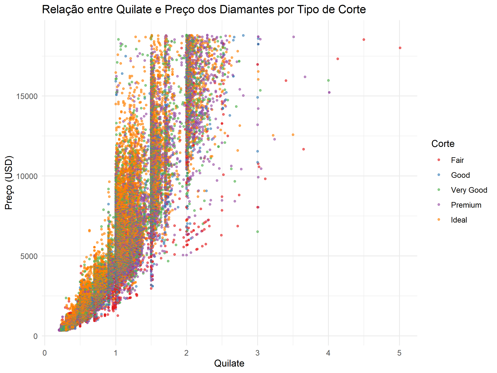

# Previsão de Preços de Diamantes

  

## Introdução

Este projeto tem como objetivo desenvolver um modelo preditivo para estimar o preço de diamantes com base em suas características físicas e qualitativas. Utilizando o conjunto de dados `diamonds` do pacote `ggplot2`, aplicaremos técnicas de análise de dados e aprendizado de máquina para entender os fatores que influenciam o preço e como eles interagem entre si.

## Justificativa

Compreender os determinantes do preço dos diamantes é essencial para diversos stakeholders no mercado de joias:

- **Joalheiros e Vendedores**: Para estabelecer preços competitivos e justos.
- **Investidores**: Para identificar oportunidades de investimento e tendências de mercado.
- **Consumidores**: Para fazer escolhas informadas ao adquirir diamantes.

Ao analisar os dados disponíveis e desenvolver um modelo preditivo confiável, podemos fornecer insights valiosos que auxiliam na tomada de decisões e na compreensão do mercado de diamantes.

## Metodologia

O projeto será desenvolvido utilizando a metodologia CRISP-DM, seguindo os seguintes passos:

1. **Entendimento de negócio**
2. **Entendimento de dados**
3. **Preparação dos dados**
4. **Modelagem**

## Graphical Abstract

*Figura 1: Visualização das principais características que influenciam o preço dos diamantes.*

## Resultados Esperados

Espera-se obter um modelo preditivo que:

- **Estime com alta precisão** o preço dos diamantes.
- **Identifique os fatores chave** que mais influenciam o valor.
- **Forneça insights acionáveis** para profissionais do setor e consumidores.

## Contribuição

Este projeto contribuirá para uma melhor compreensão do mercado de diamantes, auxiliando na transparência dos preços e na tomada de decisões informadas por parte de todos os envolvidos.
